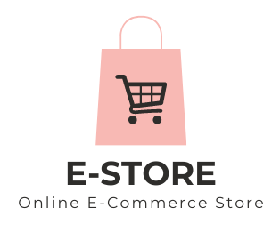

# Ecommerce App: A Full-Featured MERN Stack Ecommerce Solution

## Table of Contents

- [Overview](#overview)
- [Features](#features)
- [Technologies Used](#technologies-used)
- [Usage](#usage)
- [Contact](#contact)

## Overview

E-Store is a full-stack ecommerce platform developed using the MERN stack. The app has a complete user interface so that you can really enjoy shopping to your heart’s content with features like product browsing, cart management and Stripe for payment processing. The application includes safe user authentication, product image management, and a scalable architecture for modern ecommerce operations.

## Features

- **User Authentication**: Sign up, login using JSON Web Token (JWT).
- **Product Management**: Create, update, and delete products with image upload capabilities using Cloudinary and Multer.
- **Shopping Cart**: Add products to the cart and manage quantities.
- **Secure Payment**: Integrated Stripe for seamless payment processing.
- **Order Management**: Place and track orders.
- **Responsive Design**: Optimized for both desktop and mobile devices.

## Technologies Used

- **Frontend**:

  - React.js
  - React Router for navigation
  - Context API for state management
  - Axios for API requests

- **Backend**:

  - Node.js and Express.js
  - Mongoose for MongoDB integration
  - Multer for file uploads (product images)
  - Cloudinary for image storage
  - Bcrypt for password hashing
  - JSON Web Token (JWT) for authentication (tokens)
  - Stripe for payment processing

- **Other Tools**:
  - Validator for input validation
  - Postman for API testing
  - Git for version control

## Usage

- **Authentication**: Users can sign up and login securely with JWT-based authentication.
- **Product Management**: Admins can add new products with images, update details, or delete products.
- **Cart and Payment**: Users can add products to the cart, view order details, and process payments through Stripe and also Cash on delivery (COD).
- **Order History**: Users can view their order history and track current orders.

## Contact

For any inquiries, feel free to reach out:

- Email: [muhammadkaif1193@gmail.com](mailto:muhammadkaif1193@gmail.com)
- LinkedIn: [Muhammad Kaif](https://www.linkedin.com/in/muhammad-kaif-059a53261)
